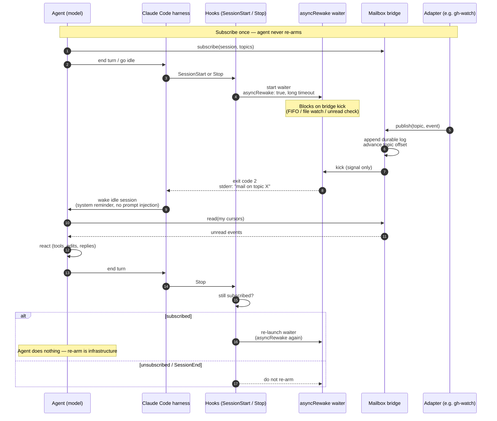

# Wake and re-arm

How an idle agent session gets woken when the world changes, and how listening
stays armed without the agent re-arming itself after every wake.

## Layers

```text
Adapters (detect world changes)
        ↓ publish
Bridge (durable events + subscriptions + wake kicks)
        ↓ harness wake
Agent sessions (react, never poll)
```

Adapters only `publish`. The bridge owns durable logs, topics, and per-subscriber
cursors. Harness integrators own the arm/wake loop.

## Claude Code: hook-owned `asyncRewake`

Claude Code can run a background hook with `asyncRewake: true`. When that process
exits with code **2**, the harness wakes an idle session and surfaces stderr (or
stdout if stderr is empty) as a system reminder.

That lets infrastructure own re-arm:

1. Agent **subscribes** to topics once.
2. `SessionStart` / `Stop` hooks launch a long-lived waiter (`asyncRewake: true`).
3. An adapter publishes → bridge appends + kicks → waiter exits 2 → session wakes.
4. Agent **reads** unread events and reacts.
5. On the next `Stop`, hooks re-launch the waiter if still subscribed.

The agent never runs an arm command after wake. Subscribe / read / react /
unsubscribe is the whole agent-facing loop.

Caveats:

- Async hook **timeout** (default ~10m) — the waiter needs a long timeout or must
  self-respawn before the harness kills it.
- Tear down the waiter on `SessionEnd` / unsubscribe.
- Wake payload should be a short reminder (“mail on topic X”), not a re-run of a
  slash command. Body stays in the durable log (payload-free wake).

## Codex CLI: no equivalent yet

Codex has lifecycle hooks (`SessionStart`, `Stop`, …) but **not** an
`asyncRewake`-style idle wake:

| Capability | Claude Code | Codex CLI |
|---|---|---|
| Lifecycle hooks | Yes | [Yes](https://developers.openai.com/codex/hooks) |
| `async: true` background hooks | Yes | Parsed, then **skipped** |
| `asyncRewake` (bg exit → wake idle) | Yes | **No** |
| Native external-event → idle wake | Via hooks / Monitor | [Requested](https://github.com/openai/codex/issues/20312), not shipped |

Codex `Stop` can continue a turn (block stop) at turn boundaries; it does not wake
a truly idle session from a background waiter. For agent-mailbox, Claude Code is
the first harness; Codex needs a fallback (manual arm) until a wake primitive
lands. Related: [monitor tool FR](https://github.com/openai/codex/issues/29922),
[bg tasks don’t wake parent](https://github.com/openai/codex/issues/15723).

## Sequence: hook-owned re-arm



## Contrast with `agent-ipc`

The earlier `agent-ipc` skill used a durable NDJSON inbox + FIFO kick +
`ipc-arm.sh` run by the agent in background mode. **One arm = one wake**; after
reading, the agent had to re-arm. Adapters (e.g. `agent-ipc-github`) were already
just senders — that split stays. What’s new is moving the arm loop into harness
hooks and adding multi-subscriber topics with per-subscriber cursors.
