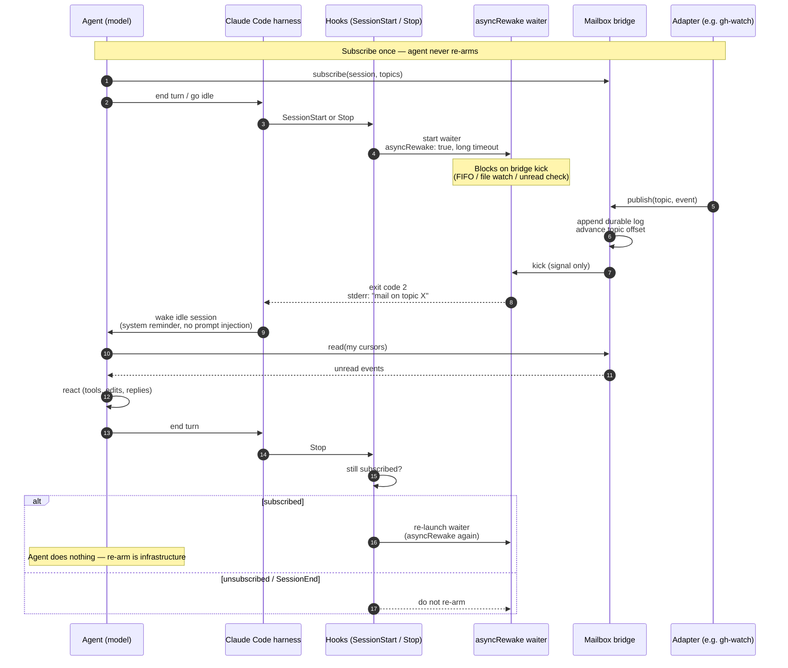

# Wake and re-arm

How an idle agent session gets woken when the world changes, and how listening
stays armed without the agent re-arming itself after every wake.

## Layers

```text
Adapters (detect world changes)
        ↓ publish
Bridge (durable events + subscriptions + wake kicks)
        ↓ harness wake
Agent sessions (react, never poll)
```

Adapters only `publish`. The bridge owns durable logs, topics, and per-subscriber
cursors. Harness integrators own the arm/wake loop.

## Claude Code: hook-owned `asyncRewake`

Claude Code can run a background hook with `asyncRewake: true`. When that process
exits with code **2**, the harness wakes an idle session and surfaces stderr (or
stdout if stderr is empty) as a system reminder.

That lets infrastructure own re-arm:

1. Agent **subscribes** to topics once.
2. `SessionStart` / `Stop` hooks launch a long-lived waiter (`asyncRewake: true`).
3. An adapter publishes → bridge appends + kicks → waiter exits 2 → session wakes.
4. Agent **reads** unread events and reacts.
5. On the next `Stop`, hooks re-launch the waiter if still subscribed.

The agent never runs an arm command after wake. Subscribe / read / react /
unsubscribe is the whole agent-facing loop.

Caveats:

- Async hook **timeout** (Claude Code's default ~10m) — it is a hard kill deadline
  on the waiter process, and **nothing the waiter does can extend it** (see
  [Timeout survival](#timeout-survival-the-re-arm-exit)). It must therefore *yield*
  before the deadline, and the timeout must be configured long.
- Tear down the waiter on `SessionEnd` / unsubscribe.
- Wake payload should be a short reminder (“mail on topic X”), not a re-run of a
  slash command. Body stays in the durable log (payload-free wake).

### Implemented: `mailbox harness` (card 11)

The loop above is real. The `mailbox` binary carries three hook targets (logic in
the `mailbox-harness` crate; the binary is a thin dispatcher that owns the socket
client):

| Hook | Command | What it does |
|---|---|---|
| `SessionStart` (matcher `startup`) / `Stop` | `mailbox harness arm` (`asyncRewake: true`, `timeout` 1h by default) | Reads `session_id` from the hook stdin JSON, **registers the session's agent inbox** (`agent.<session-id>`, always-on — ADR-0007), asks the bridge whether the session has any subscriptions, and `exec`s `mailbox wait` — unless the bridge answers cleanly that it subscribes to **nothing** (→ exit 0, no wake: nothing to be woken about). A bridge that is **down or erroring** is retried briefly and then **armed anyway** (fail-open): the waiter needs no daemon and re-checks subscriptions itself under its lock, so it self-exits if there are none — whereas skipping would leave an idle session with no waiter and no further `Stop` to retry it (ADR-0006). |
| `SessionEnd` | `mailbox harness cleanup` | Reaps the waiter (`SIGTERM` the pidfile PID, remove the pidfile) and calls the bridge to drop this session's subscriptions **and** interests, stopping any adapter whose last interest it held (feeds the card-08 refcount — no zombie poller outlives the session). |
| install | `mailbox harness install-hooks [--settings <path>]` | Merges the hooks snippet into the Claude Code `settings.json` — `--settings <path>`, else `~/.claude/settings.json` when it exists — *atomically*, preserving unrelated settings; prints only (with the reason) when there is no such file. |

**Session identity (settled).** Claude Code passes the hook payload as JSON on
stdin, including `session_id`. `arm`/`cleanup` parse that into a branded
`SessionId` (shared with the bridge in `mailbox-protocol`); `arm` execs `mailbox
wait --session <id>` (the CLI also honours the `MAILBOX_SESSION_ID` env fallback).
That closes the previously-open "how does a session name itself" question — the
answer is *the hook tells us*.

**Coordination: the lock is the source of truth (ADR-0006).** Exactly one waiter
may be live per session, guarded by an advisory lock. The **waiter — not `arm` —
owns the pidfile**, written only *after* it takes that lock; a waiter that loses
the lock exits without touching it. So the pidfile always names the one live
lock-holding waiter, and `cleanup` reaps that stable PID. (Previously `arm` wrote
the pidfile pre-lock, so a doomed second arm could overwrite it with its own dead
pid and orphan the real waiter — HIGH#1.) The pidfile, FIFO, and lock share one
filename stem via a single `SessionId::encode_filename` encoder, so they key a
session identically.

**Arm-iff-subscribed, enforced twice.** A wake is only meaningful if the session
subscribes to something. `arm` probes `status` over the socket (empty list, error
reply, or unreachable bridge all → a typed *skip*, never a wake). The **waiter
re-checks** `has_subscription` after taking the lock and self-exits cleanly (exit
0, pidfile removed) if there is none — catching an `arm` whose probe passed but
whose `SessionEnd`/unsubscribe then landed, so no orphan waiter survives (HIGH#2).

**Always-on agent inbox (card 16 / ADR-0007).** Before it probes, `arm` subscribes
the session to its own inbox topic `agent.<session-id>` — every session, every
`SessionStart` and `Stop`, idempotently. That is what makes an agent addressable by
its peers (`mailbox send <session-id>`) with nothing for the agent to do.

The rule above is unchanged; what changed is that **a live session's subscription
list is now never empty**, so a live session always arms a waiter while the bridge
is up. That is intended: the cost is one blocked `mailbox wait` per live session
(blocked in `poll`, no CPU), and the benefit is that any agent can be woken by any
other. Every fail-safe still holds: registration is best-effort (it never fails the
hook), a down/erroring bridge still means exit 0 and no wake, and the waiter's
post-lock `has_subscription` re-check is untouched — a session whose `SessionEnd`
raced the arm still self-exits rather than orphaning a waiter.

**Payload-free wake.** The waiter's stderr on exit 2 is only `mail on topic X`
(topic names, never a body); the body stays in the durable log and is read by the
agent's later `read`. To keep that wire clean regardless of `RUST_LOG`, `wait` and
`harness arm` route their `tracing` to `<db-dir>/harness.log`, never stderr.

### Timeout survival: the re-arm exit

Claude Code kills a `command` hook at its `timeout`. **The waiter cannot outlive its
hook process, and nothing it does can extend that deadline.** Two things settle the
design, and both are now measured rather than assumed (they were the ADR's "open
empirical question" — it is closed):

1. **`execv` does NOT reset the hook timeout.** It preserves the PID and the deadline
   is measured per process, so a waiter that re-execs itself is killed on the
   original clock anyway.
2. **A large `timeout` IS honoured.** A hook with `timeout: 3600` ran far past the
   600s default (alive at 703s). There is no hidden 600s cap.

And the thing that makes a killed waiter *fatal* rather than merely inconvenient:
**a truly idle session fires no further `Stop`.** Nothing re-arms it. So a waiter
killed mid-block leaves the session permanently, silently unwakeable — subscription
intact, events still landing durably, `publish` quietly reporting `NoReader`. That
was a real bug (ADR-0006), and its fingerprint was a **stale pidfile naming a dead
pid**, which made `mailbox agents` keep reporting a waiter that no longer existed.

The waiter therefore **yields before the deadline instead of trying to beat it**:

- `arm` execs `mailbox wait --max-block-ms <N>` with `N` safely below the hook
  `timeout` (defaults: `N = 3 300 000` ms = 55 min, `timeout = 3600` s = 1 h).
- `mailbox wait` blocks on the kick for at most `N`. On mail → **exit 2**, stderr
  `mail on topic X`. On reaching `N` with no mail → **exit 2** with a *benign* notice:

  ```text
  mailbox: re-arming the waiter (no new mail) — nothing to read; just end your turn
  and the Stop hook will re-arm it
  ```

- Either way the exit-2 wakes the session → the agent's turn ends → `Stop` fires →
  `arm` runs → a **fresh hook process with a fresh timeout**. The loop is closed:
  there is no state in which an idle session is armed by nobody.
- The yielding waiter removes its own pidfile (it is about to die), and `arm` reaps a
  stale pidfile naming a dead pid before it arms — so a killed waiter can never keep
  passing for a live one.
- Each fresh waiter repeats the card-05 **open → check-then-block** ordering, so a
  publish that lands during the re-arm gap is caught by the next waiter's unread
  check rather than missed.

The cost is one benign wake per `max_block` of continuous idle (55 min by default).
An agent that sees it should do **nothing** — ending the turn is what re-arms it.
**A larger `--timeout-secs` (with a matching `--max-block-ms`) means fewer such
wakes**; `install-hooks` refuses a `max_block` that is not safely below `timeout`,
because that pairing silently reintroduces the bug — and `arm` enforces the same rule
at run time, clamping (loudly) a `--max-block-ms` that is not safely below the
`--timeout-secs` it was launched with (assuming Claude Code's own 600s default when the
hook carries no `timeout`). The invariant is checked where it is *used*, not only where
it is written. The whole loop is exercised
without a live Claude Code (`crates/mailbox/tests/harness.rs`, which churns the
re-arm boundary and asserts the session is never left unarmed).

### install-hooks

`mailbox harness install-hooks` merges the snippet below into the Claude Code
settings file — `--settings <file>` if given (created if missing), else
`~/.claude/settings.json` when it exists — idempotently, preserving unrelated
settings; with no such file it only emits the snippet (JSON) and says why. The
`arm` command carries `--max-block-ms` **and `--timeout-secs`**, so both the re-arm
bound and the deadline it must stay under travel with the hook; the install **fails
loudly** if `--max-block-ms` is not safely below `--timeout-secs`, and `arm` clamps it
loudly at run time if the hook it was launched from says otherwise.

```json
{
  "hooks": {
    "SessionStart": [{ "matcher": "startup", "hooks": [{ "type": "command",
      "command": "/abs/path/to/mailbox harness arm --max-block-ms 3300000 --timeout-secs 3600",
      "asyncRewake": true, "timeout": 3600 }] }],
    "Stop": [{ "matcher": "", "hooks": [{ "type": "command",
      "command": "/abs/path/to/mailbox harness arm --max-block-ms 3300000 --timeout-secs 3600",
      "asyncRewake": true, "timeout": 3600 }] }],
    "SessionEnd": [{ "matcher": "", "hooks": [{ "type": "command",
      "command": "/abs/path/to/mailbox harness cleanup" }] }]
  }
}
```

### Diagnosing a wake ("why didn't my agent wake?")

The waiter lifecycle is logged at **INFO** (the default) to `<db-dir>/harness.log`,
and the daemon logs its kick counts at INFO on its own stderr. Between them they
answer the question directly:

| Line | Means |
|---|---|
| `armed session (subscribed); exec-ing the waiter` | a waiter was launched (and whether a stale pidfile was reaped) |
| `waiter found no subscriptions; exiting without waking` | arm-iff-subscribed said no |
| `waiter woke; session has unread mail (exiting 2)` | a real wake, with the topics |
| `waiter reached its max-block with no mail; exiting 2 to force a fresh re-arm` | the benign re-arm boundary |
| `kicked subscribed sessions after publish` (`delivered` / `no_reader`) | whether the publish actually reached a live waiter |
| `another waiter already holds this session's lock` | **benign** — the expected loser of a SessionStart-vs-Stop arm race |

## Codex CLI: no equivalent yet

Codex has lifecycle hooks (`SessionStart`, `Stop`, …) but **not** an
`asyncRewake`-style idle wake:

| Capability | Claude Code | Codex CLI |
|---|---|---|
| Lifecycle hooks | Yes | [Yes](https://developers.openai.com/codex/hooks) |
| `async: true` background hooks | Yes | Parsed, then **skipped** |
| `asyncRewake` (bg exit → wake idle) | Yes | **No** |
| Native external-event → idle wake | Via hooks / Monitor | [Requested](https://github.com/openai/codex/issues/20312), not shipped |

Codex `Stop` can continue a turn (block stop) at turn boundaries; it does not wake
a truly idle session from a background waiter. For agent-mailbox, Claude Code is
the first harness; Codex needs a fallback (manual arm) until a wake primitive
lands. Related: [monitor tool FR](https://github.com/openai/codex/issues/29922),
[bg tasks don’t wake parent](https://github.com/openai/codex/issues/15723).

## Sequence: hook-owned re-arm



## Contrast with `agent-ipc`

The earlier `agent-ipc` skill used a durable NDJSON inbox + FIFO kick +
`ipc-arm.sh` run by the agent in background mode. **One arm = one wake**; after
reading, the agent had to re-arm. Adapters (e.g. `agent-ipc-github`) were already
just senders — that split stays. What’s new is moving the arm loop into harness
hooks and adding multi-subscriber topics with per-subscriber cursors.
