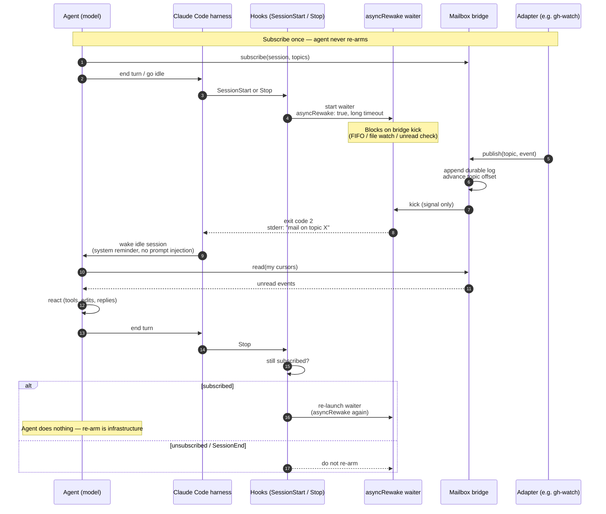

# Wake and re-arm

How an idle agent session gets woken when the world changes, and how listening
stays armed without the agent re-arming itself after every wake.

## Layers

```text
Adapters (detect world changes)
        ↓ publish
Bridge (durable events + subscriptions + wake kicks)
        ↓ harness wake
Agent sessions (react, never poll)
```

Adapters only `publish`. The bridge owns durable logs, topics, and per-subscriber
cursors. Harness integrators own the arm/wake loop.

## Claude Code: hook-owned `asyncRewake`

Claude Code can run a background hook with `asyncRewake: true`. When that process
exits with code **2**, the harness wakes an idle session and surfaces stderr (or
stdout if stderr is empty) as a system reminder.

That lets infrastructure own re-arm:

1. Agent **subscribes** to topics once.
2. `SessionStart` / `Stop` hooks launch a long-lived waiter (`asyncRewake: true`).
3. An adapter publishes → bridge appends + kicks → waiter exits 2 → session wakes.
4. Agent **reads** unread events and reacts.
5. On the next `Stop`, hooks re-launch the waiter if still subscribed.

The agent never runs an arm command after wake. Subscribe / read / react /
unsubscribe is the whole agent-facing loop.

Caveats:

- Async hook **timeout** (default ~10m) — the waiter needs a long timeout or must
  self-respawn before the harness kills it.
- Tear down the waiter on `SessionEnd` / unsubscribe.
- Wake payload should be a short reminder (“mail on topic X”), not a re-run of a
  slash command. Body stays in the durable log (payload-free wake).

### Implemented: `mailbox harness` (card 11)

The loop above is real. The `mailbox` binary carries three hook targets (logic in
the `mailbox-harness` crate; the binary is a thin dispatcher that owns the socket
client):

| Hook | Command | What it does |
|---|---|---|
| `SessionStart` (matcher `startup`) / `Stop` | `mailbox harness arm` (`asyncRewake: true`, `timeout` ~10m) | Reads `session_id` from the hook stdin JSON, **registers the session's agent inbox** (`agent.<session-id>`, always-on — ADR-0007), asks the bridge whether the session has any subscriptions, and — **iff subscribed** — `exec`s `mailbox wait`. Not subscribed, or the bridge is down/erroring → exit 0, **no wake** (fail-safe). |
| `SessionEnd` | `mailbox harness cleanup` | Reaps the waiter (`SIGTERM` the pidfile PID, remove the pidfile) and calls the bridge to drop this session's subscriptions **and** interests, stopping any adapter whose last interest it held (feeds the card-08 refcount — no zombie poller outlives the session). |
| install | `mailbox harness install-hooks [--settings <path>]` | Merges the hooks snippet into the Claude Code `settings.json` — `--settings <path>`, else `~/.claude/settings.json` when it exists — *atomically*, preserving unrelated settings; prints only (with the reason) when there is no such file. |

**Session identity (settled).** Claude Code passes the hook payload as JSON on
stdin, including `session_id`. `arm`/`cleanup` parse that into a branded
`SessionId` (shared with the bridge in `mailbox-protocol`); `arm` execs `mailbox
wait --session <id>` (the CLI also honours the `MAILBOX_SESSION_ID` env fallback).
That closes the previously-open "how does a session name itself" question — the
answer is *the hook tells us*.

**Coordination: the lock is the source of truth (ADR-0006).** Exactly one waiter
may be live per session, guarded by an advisory lock. The **waiter — not `arm` —
owns the pidfile**, written only *after* it takes that lock; a waiter that loses
the lock exits without touching it. So the pidfile always names the one live
lock-holding waiter, and `cleanup` reaps that stable PID. (Previously `arm` wrote
the pidfile pre-lock, so a doomed second arm could overwrite it with its own dead
pid and orphan the real waiter — HIGH#1.) The pidfile, FIFO, and lock share one
filename stem via a single `SessionId::encode_filename` encoder, so they key a
session identically.

**Arm-iff-subscribed, enforced twice.** A wake is only meaningful if the session
subscribes to something. `arm` probes `status` over the socket (empty list, error
reply, or unreachable bridge all → a typed *skip*, never a wake). The **waiter
re-checks** `has_subscription` after taking the lock and self-exits cleanly (exit
0, pidfile removed) if there is none — catching an `arm` whose probe passed but
whose `SessionEnd`/unsubscribe then landed, so no orphan waiter survives (HIGH#2).

**Always-on agent inbox (card 16 / ADR-0007).** Before it probes, `arm` subscribes
the session to its own inbox topic `agent.<session-id>` — every session, every
`SessionStart` and `Stop`, idempotently. That is what makes an agent addressable by
its peers (`mailbox send <session-id>`) with nothing for the agent to do.

The rule above is unchanged; what changed is that **a live session's subscription
list is now never empty**, so a live session always arms a waiter while the bridge
is up. That is intended: the cost is one blocked `mailbox wait` per live session
(blocked in `poll`, no CPU), and the benefit is that any agent can be woken by any
other. Every fail-safe still holds: registration is best-effort (it never fails the
hook), a down/erroring bridge still means exit 0 and no wake, and the waiter's
post-lock `has_subscription` re-check is untouched — a session whose `SessionEnd`
raced the arm still self-exits rather than orphaning a waiter.

**Payload-free wake.** The waiter's stderr on exit 2 is only `mail on topic X`
(topic names, never a body); the body stays in the durable log and is read by the
agent's later `read`. To keep that wire clean regardless of `RUST_LOG`, `wait` and
`harness arm` route their `tracing` to `<db-dir>/harness.log`, never stderr.

### Timeout survival: self-respawn by re-exec

Claude Code kills a `command` hook after its `timeout` (default 10 minutes). A
truly idle session gets no further `Stop`, so if the waiter were simply killed the
session would silently go un-armed. The waiter therefore **self-respawns**:

- `arm` execs `mailbox wait --max-block-ms <N>` with `N` shorter than the hook
  `timeout` (defaults: `N = 540 000` ms vs `timeout = 600` s).
- `mailbox wait` blocks on the kick for at most `N`. On mail → exit 2 (wake). On
  reaching `N` with no mail → it **re-execs itself** (`execv`, same argv).
- `execv` replaces the process image but **preserves the PID**, so the harness's
  pidfile keeps identifying the live waiter across every respawn, and `cleanup`
  reaps that one stable PID.
- Each fresh waiter repeats the card-05 **open → check-then-block** ordering, so a
  publish that lands during the re-exec gap is caught by the next waiter's unread
  check rather than missed.

Why re-exec (a fresh process image) rather than an internal loop: the goal is to
present the harness with a *new* process before its per-hook timeout lands on a
live wait. Whether Claude Code measures the async-hook timeout per PID or per
process-image across `execv` is **not documented** (we could not confirm it either
way). We therefore keep `max_block` well under `timeout` so the re-exec always
precedes the kill deadline, and expose both as install-time knobs
(`--max-block-ms`, `--timeout-secs`): if `execv` resets the timer, an arbitrarily
long idle stays armed; if it does not, the waiter still survives to the configured
`timeout`, after which the next `Stop` re-arms — and an operator can raise
`--timeout-secs` for a longer guaranteed idle. This uncertainty is the one open
empirical question; everything else is exercised without a live Claude Code
(`crates/mailbox/tests/harness.rs`).

### install-hooks

`mailbox harness install-hooks` merges the snippet below into the Claude Code
settings file — `--settings <file>` if given (created if missing), else
`~/.claude/settings.json` when it exists — idempotently, preserving unrelated
settings; with no such file it only emits the snippet (JSON) and says why. The
`arm` command carries `--max-block-ms` so the self-respawn bound travels with the
hook.

```json
{
  "hooks": {
    "SessionStart": [{ "matcher": "startup", "hooks": [{ "type": "command",
      "command": "/abs/path/to/mailbox harness arm --max-block-ms 540000",
      "asyncRewake": true, "timeout": 600 }] }],
    "Stop": [{ "matcher": "", "hooks": [{ "type": "command",
      "command": "/abs/path/to/mailbox harness arm --max-block-ms 540000",
      "asyncRewake": true, "timeout": 600 }] }],
    "SessionEnd": [{ "matcher": "", "hooks": [{ "type": "command",
      "command": "/abs/path/to/mailbox harness cleanup" }] }]
  }
}
```

## Codex CLI: no equivalent yet

Codex has lifecycle hooks (`SessionStart`, `Stop`, …) but **not** an
`asyncRewake`-style idle wake:

| Capability | Claude Code | Codex CLI |
|---|---|---|
| Lifecycle hooks | Yes | [Yes](https://developers.openai.com/codex/hooks) |
| `async: true` background hooks | Yes | Parsed, then **skipped** |
| `asyncRewake` (bg exit → wake idle) | Yes | **No** |
| Native external-event → idle wake | Via hooks / Monitor | [Requested](https://github.com/openai/codex/issues/20312), not shipped |

Codex `Stop` can continue a turn (block stop) at turn boundaries; it does not wake
a truly idle session from a background waiter. For agent-mailbox, Claude Code is
the first harness; Codex needs a fallback (manual arm) until a wake primitive
lands. Related: [monitor tool FR](https://github.com/openai/codex/issues/29922),
[bg tasks don’t wake parent](https://github.com/openai/codex/issues/15723).

## Sequence: hook-owned re-arm



## Contrast with `agent-ipc`

The earlier `agent-ipc` skill used a durable NDJSON inbox + FIFO kick +
`ipc-arm.sh` run by the agent in background mode. **One arm = one wake**; after
reading, the agent had to re-arm. Adapters (e.g. `agent-ipc-github`) were already
just senders — that split stays. What’s new is moving the arm loop into harness
hooks and adding multi-subscriber topics with per-subscriber cursors.
