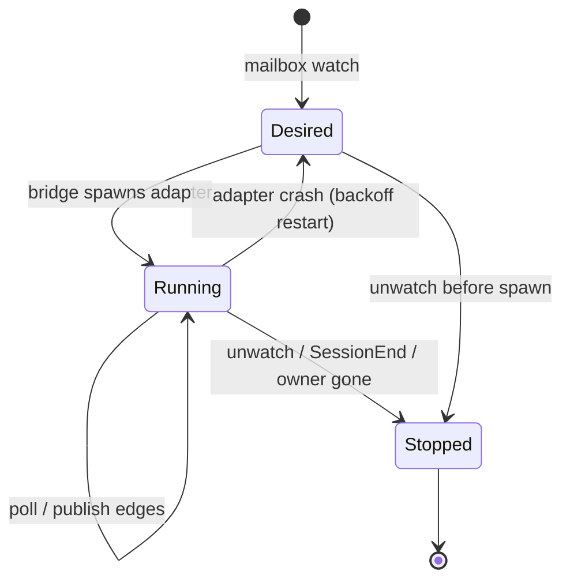

# Design: MVP — GitHub PR watch (agent-ipc parity)

- Status: Draft
- Related ADRs: [0001](../adr/0001-rust-bridge-subprocess-adapters.md),
  [0002](../adr/0002-mvp-crate-stack.md),
  [0003](../adr/0003-single-writer-sqlite.md)
- Related: [01-wake-and-rearm](../01-wake-and-rearm.md), prior skill
  `agent-ipc` / `agent-ipc-github`

## Goal

Replace the existing skill-based IPC loop for **one concrete case**: wake an
idle Claude Code session when a watched GitHub PR gains merge conflicts or new
review activity — without the agent re-arming, and **without zombie GitHub
pollers**.

Parity with `agent-ipc-github`:

- Edge-triggered (baseline on first poll; fire on transitions only)
- Watch mergeable → `CONFLICTING` (ignore transient `UNKNOWN`)
- Watch new reviews / review threads / PR comments
- Persist watcher baseline so restarts don’t re-fire
- Default poll interval ~60s

## Non-goals (MVP)

- CI status watching (other skills already cover that)
- Multi-host / cloud bus
- WASI adapters
- Codex `asyncRewake` parity (manual arm fallback only)
- Full peer chat-room product (topics should allow it later; not the MVP demo)

## Shape

```text
┌─────────────────┐  publish(topic, event)   ┌──────────────────┐
│ github-pr       │ ───────────────────────► │ mailbox bridge   │
│ adapter         │                          │ (single SQLite   │
│ (subprocess)    │  supervised by bridge    │  writer)         │
└─────────────────┘                          └────────┬─────────┘
                                                      │ kick
                                                      ▼
                                             ┌──────────────────┐
                                             │ Claude harness   │
                                             │ asyncRewake      │
                                             │ waiter           │
                                             └──────────────────┘
```

- **Topic** (example): `github.pr.<owner>/<repo>#<n>` or a stable id derived
  from `(owner, repo, pr)`.
- **Adapter** only polls and publishes; it does not wake agents or touch SQLite.
- **Bridge** owns durability, subscriptions, delivery cursors, and **adapter
  process lifecycle**.
- **Harness** owns arm/re-arm via hooks ([01-wake-and-rearm](../01-wake-and-rearm.md)).

## Adapter lifecycle (no zombies)

The failure mode in the old skill: `gh-watch.sh` is started with
`run_in_background` and **never exits**; if the session dies or the agent
forgets to kill it, pollers pile up.

MVP rules:

1. **Bridge-supervised adapters.** Starting a watch is
   `mailbox watch github-pr …` (name TBD), not “agent spawns a naked bash loop.”
   The bridge records the watch in SQLite and owns the child process.
2. **Idempotent start.** Same `(session_or_owner, repo, pr)` → one running
   adapter. A second start is a no-op or returns the existing watch id.
3. **Explicit stop.** `mailbox unwatch …` / unsubscribe tears down the child and
   clears the row (or marks it stopped).
4. **Session end ⇒ stop watches owned by that session.** Harness `SessionEnd`
   (and unsubscribe) must tell the bridge to stop session-scoped watches so a
   dead Claude session cannot leave pollers behind.
5. **Bridge restart.** On startup, either resume watches still marked desired
   **or** require re-declare — prefer **resume only if the owning session is
   still alive**; otherwise mark stopped. Exact session-liveness probe is
   harness-specific; until we have one, default to **do not resume orphan
   watches** (fail safe: missed events > zombie API load).
6. **Adapter crash.** Bridge restarts with backoff **only while the watch row is
   still desired**; give up and surface an error event after N failures.
7. **No agent-owned infinite bash.** Agents declare intent; they do not hold the
   poll loop in a tool background task.



## Data the bridge stores (sketch)

| Record | Purpose |
|---|---|
| `watch` | id, kind=`github-pr`, repo, pr, interval, owner session, desired/stopped, child pid |
| `adapter_baseline` | last mergeable + review/thread/comment counts (edge detect) |
| `event` | durable topic log |
| `subscription` | session ↔ topics |
| `delivery_cursor` | per subscriber; advanced by harness/bridge on surface |

Adapter baseline can live in SQLite (preferred) instead of
`~/.claude/agent-ipc/watchers/*.state` so restart/idempotency is centralized.

## Agent-facing loop (MVP)

1. Subscribe to the PR topic (or `mailbox watch` implies subscribe for this
   session).
2. Work / idle — hooks keep `asyncRewake` armed.
3. On wake: read unread events; react (same actions as the old skill).
4. Unwatch / unsubscribe when done — **required** for clean teardown.

No `ipc-arm.sh` step.

## Failure modes

| Failure | Behaviour |
|---|---|
| `gh` auth missing | Adapter exits non-zero; bridge records error, does not spin forever without surfacing |
| GitHub rate limit | Backoff inside adapter; still one process per watch |
| Bridge down | Publish/watch commands fail; no silent orphan writers |
| Session killed hard | Next bridge reconcile / TTL sweeper stops watches with dead owners (MVP: SessionEnd hook + periodic “owner still registered?” check) |
| Mid-turn publishes | Delivery cursor + Stop re-arm ([01](../01-wake-and-rearm.md)) |

## Test plan

1. Stub or recorded `gh` responses: conflict transition publishes exactly once.
2. Double `watch` same PR → still one child (`pgrep` / bridge status).
3. `unwatch` / SessionEnd → child gone; no further API calls.
4. Two subscribers on one topic → independent delivery cursors.
5. Kill adapter process → one restart while desired; stop when undesired.
6. Bridge restart with no live owner → watch not resumed (no zombie).

## Open questions

- Exact CLI surface (`watch` vs `adapter start`).
- How Claude session identity is named for ownership (session_id from hooks).
- Whether peer agent→agent messages are in the same MVP slice or immediately
  after GitHub watch.
